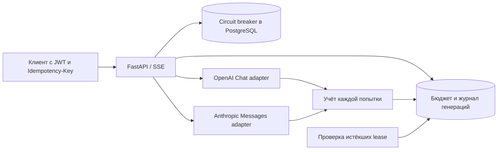

# Как устроен RelayLM

При приёме запроса блокируется строка бюджета пользователя. Проверяются ключ повтора, число активных запросов, доступные кредиты и счётчик текущей минуты. Резерв покрывает оценку двух настроенных попыток. Его нельзя одновременно потратить нескольким конкурентным запросам.

Перед outbound HTTP фиксируется отдельная попытка с копией цен и их версией. Если процесс исчезнет между записью попытки и отправкой запроса, эта попытка тоже будет консервативно учтена. Без внешнего подтверждения отличить её от принятой провайдером невозможно. Неначатая резервная попытка не списывается.

Settlement блокирует пользователя, затем генерацию — один и тот же порядок во всех вызовах. Только `running` может перейти в конечный статус. Одной транзакцией освобождается весь резерв, добавляется расход попыток и сохраняется результат. Повторный settlement не меняет баланс. Остаток — `budget - spent - reserved`.

Reaper раз в секунду выбирает запросы с истёкшей арендой. После SIGKILL они получают `abandoned`, незавершённые попытки — оценку расхода. Reaper не повторяет генерацию: клиент решает, нужен ли новый запрос с новым ключом. В нормальном пути общий timeout ограничен 20 секундами, lease — 90 секундами. Изменять их так, чтобы lease был короче работы запроса, нельзя.

Circuit хранит число ошибок, время открытия, lease пробного запроса и поколение. Открытие увеличивает поколение: старый успешный ответ уже не сможет закрыть новый circuit. После cooldown только один конкурентный запрос получает пробный допуск. При отмене клиента пробный слот освобождается без новой ошибки.

Async httpx-клиент живёт весь lifespan приложения. Upstream-итератор закрывается через `aclosing`; settlement защищён от отмены ASGI. При SIGKILL выполнить `finally` невозможно, поэтому нужен durable journal и reaper.

Запросы пользователя не сохраняются в базе: сохраняется хеш тела. Сгенерированный текст сохраняется для повтора успешного ответа. Логи не содержат тел и API-ключей. История доступна только владельцу; информация о провайдерах и изменение бюджетов — администратору.
